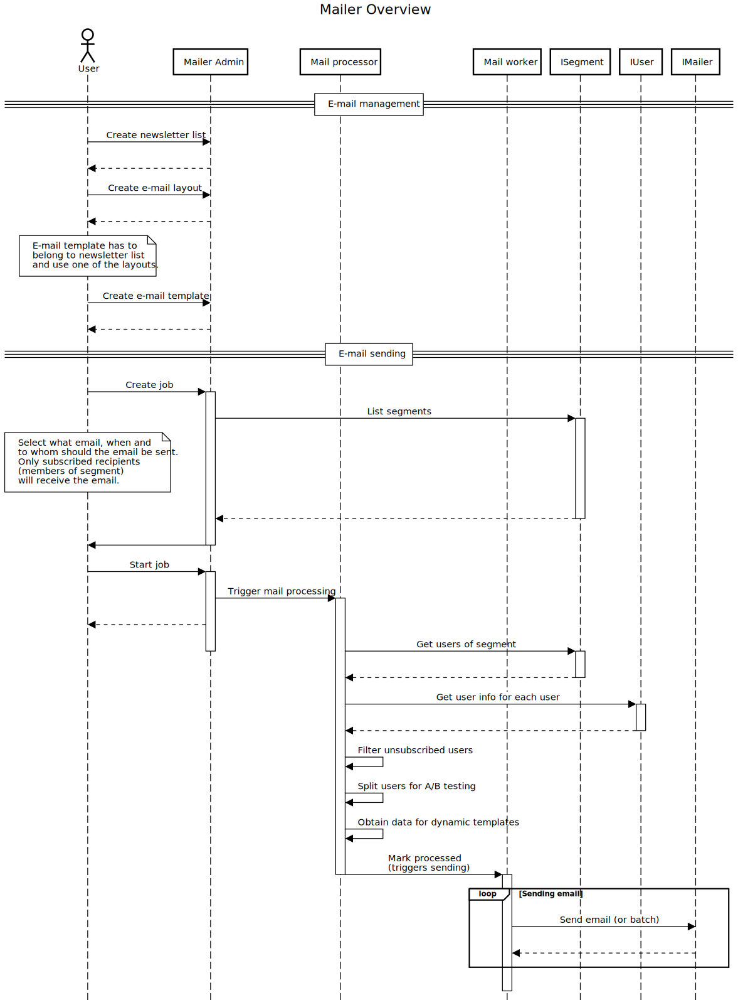

# Mailer

## Admin (Nette)

Mailer Admin serves as a tool for configuration of mailers, creation of email layouts and
templates, and configuring and sending mail jobs to selected segments of users.

When the backend is ready, don't forget to install dependencies and run DB migrations:

```bash
# 1. Download PHP dependencies
composer install

# 2. Download JS/HTML dependencies
yarn install

# !. use extra switch if your system doesn't support symlinks (Windows; can be enabled)
yarn install --no-bin-links

# 3. Generate assets
make js

# 4. Run migrations
php bin/command.php migrate:migrate

# 5. Run seeders
php bin/command.php db:seed
php bin/command.php demo:seed # optional
```

You can override any default config from
[`config.neon`](./app/config/config.neon) by creating file
`config.local.neon` and setting your own values.

#### Dependencies

- PHP 7.4
- MySQL 5.7
- Redis 3.2

### Technical feature description

#### Mailers setup

You can setup multiple mailers to send emails with. Use `code` in `addMailer` function (see example) to differentiate between
mailers of the same type. In the settings you have to provide necessary values for each mailer.

* example setup of multiple mailers

    ```neon
    mailFactory:
        setup:
            - addMailer(Remp\MailerModule\Models\Mailer\MailgunMailer(), 'us')
            - addMailer(Remp\MailerModule\Models\Mailer\MailgunMailer(), 'eu')
    ```


##### Newsletter lists

Lists represent categories of emails (newsletters). Their primary (and only) use case is to group single emails within
a newsletter and manage subscriptions of users to these newsletters.

When you create a new newsletter, you can specify:

* *Name.* User-friendly name of the newsletter (e.g. "Weekly newsletter", "Breaking news", ...)
* *Code.* Computer-friendly name of the newsletter (slug; e.g. "weekly_newsletter", "breaking_news", ...)
* *Auto subscribe flag.* Flag indicating whether new users (reported by external CRM via API) should be automatically
subscribed to the newsletter or not.
* *Public flag.* Flag indicating whether the newsletter should be listed in the public listing available for end users.
Mailer doesn't provide a user-facing frontend, so this flag is targeted primarily for the party implementing the frontend.

Any handling of subscription/unsubscription of end users from newsletters is handled via API. Publishers mostly want
to have this included within the customer zone of their systems - designed consistently with the rest of their system.
Therefore, Mailer doesn't provide **any** user-facing frontend.

To see the APIs to integration subscription management, see [Managing user subscription](#managing-user-subscriptions)
section.

##### Emails and Layouts

Emails and layouts provide a way how to manually create emails with the possibility to see realtime preview of the email
while doing so. As the names suggest:

* *Layouts.* They are common and reusable parts of the emails. Usually header (containing logo and welcome message) and
    footer (containing your credentials, link to unsubscribe).

    To have emails generated correctly, place `{{ content|raw }}` to the place where content of actual *email* should be
    injected.

* *Emails.* They represent actual content of the *email* (e.g. single edition of the weekly newsletter). Every *email* has
a couple of settings you can configure:

    * *Name.* User-friendly name of the email. It's displayed only in the administration parts of the system.
    * *Code.* Computer-friendly name of the email (slug). Primarily being used when referencing single email that's being
    sent manually.
    * *Description.* Internal description, so you know even after a year what the purpose of email was.
    * *Layout.* Layout to be used.
    * *Newsletter list.* Newsletter (category) to which this email belongs. Before the email is sent to specific end-user,
    Mailer checks whether the user is subscribed to this newsletter or not. If he/she is not, the email will not be sent.
    * *From.* Who should be used as a sender of email (e.g. `Support <support@example.com`).
    * *Subject.* Email subject.
    * *Text version.* Text version used as a fallback by email clients.
    * *HTML version.* HTML (primary) version of email that people will see. HTML version will show preview in the
    form for creation of new email.

HTML version can be edited by CodeMirror editor (html, default) or Trumbowyg editor (WYSIWYG).
Default editor can be changed using `.env` variable `TEMPLATE_EDITOR`. (options: `codemirror`, `wysiwyg`)

Text and HTML versions of *email* support [Twig syntax](https://twig.symfony.com/doc/2.x/templates.html) and you can use
standard Twig features in your templates. Mailer is able to provide custom variables to your templates. These can
originate from different sources:

* System variables.
  * `autologin`: generates and prints unique token for each email address, that can be later validated via
  [users/check-token](#get-apiv1userscheck-token) API.

    It's meant to be used within URLs (e.g. `http://dennikn.sk/email-settings{{ autologin }}`)

* Variables provided by [Generators](#generators), which can **only** be used in generator templates.
If your generator provides `foo` variable, you can use it as `{{ foo }}` in your generator template.

* Variables provided by `IUser` (see [User integration](#user-integration)). For example if the response from your API
includes `first_name` key as described in the user integration example, you can use it in your email template as
`{{ first_name }}` variable.

*Note: Mailer doesn't verify presence of the variable nor does it currently provide fallback value. If you use the
custom variable and it won't be present in the `IUser` response, empty string will be injected into your email body.*

Saving the *email* doesn't trigger any sending. It creates an instance of *email* that might be sent manually (or by 3rd
parties) via API or as a *batch* within a Mailer's *job*.

##### Jobs

*Jobs* can be understood as a newsletter sending orders. They can consist of smaller *batches* which provide their own
statistics. This is useful when you want to run an A/B test on smaller *batch*, evaluate and send the *email* to rest of the users.

When creating a *job*, you implicitly create also its first *batch*. The *job* has only one option shared across all batches:

* *Segment.* Defines which [*segment* of users](#segment-integration) (needs integration) should receive the email. This does not relate to
the *newsletter* subscribers in any way. *Segment* of users should simply state the set of users you're targeting. For
example *"people registered yesterday"* or *"people without a payment"*. It's configured on a *job* level and it's shared
across all *batches*.

All the other options are related to the *batch* that is created with the *job*. Afterwards you'll be able to create more
*batches* within the job if necessary.

* *Method.* Specifies whether the list of emails provided by *segment* should be randomized or the emails should be sent within
the same order as they were returned within *segment*.
* *Email A.* Primary *email* to be sent (implicitly indicates *newsletter list* which will be used for checking whether user can receive the *email*).
* *Email B.* If you want to include A/B test within your batch, you can specify the other variant of *email*.
Distribution of variants will be uniform between all variants.
* *Number of emails.* Limits number of emails to be sent within the batch.
* *Start date.* Specifies when the batch should be sent (now or in the future).

When the *job*/*batch* is created, you need to push *"Start sending"* button to trigger the execution. First, the background processor
will receive necessary information about target group of users and prepares metadata for sending daemon.

Once the metadata is ready and the *batch* is in the *processed* state, it will be picked up by sending daemon and
actual emails will be sent via preconfigured Mailer (SMTP, Mailgun, ...).

You can create and execute *jobs*/*batches* programmatically by using provided API endpoints.

##### Generators

Generators are single-purpose implementations that help to generate HTML/text content of *emails* programmatically
based on the provided input. That means that instead of manually preparing *email* content (HTML to send) every time
you want to send an email, you can simplify the creation by implementing custom generator that can do the hard work
for you.

For example the generator can require list of URLs to your articles. When it gets them, it will parse the content of
the URLs, extracts title, excerpt and image of the article and injects that into the prepared generator template.
Person preparing the email has a guarantee that he/she won't create invalid HTML (due to typo) and the whole process
is sped up as the only thing he/she needs to enter are article URLs. The flow we just described matches with how
[`UrlParserGenerator`](app/models/Generators/UrlParserGenerator.php) works.

Each prepared *generator template* is directly linked to a generator implementation. It's therefore guaranteed that the
variables used within generator template will always be provided (unless the implementation contains a bug).

###### Implementing generator

To create a new generator, you need to implement [`Remp\MailerModule\Generators\IGenerator` interface](app/models/Generators/IGenerator.php).
Methods are described below with references to `UrlParserGenerator`:

* `generateForm(Form $form)`. Generators need a way how to get arbitrary input from user. This method should add new
form elements into the `$form` instance and state the validation rules.

    ```php
    class UrlParserGenerator implements IGenerator
    {
        // ...
        public function generateForm(Form $form)
        {
            // ...

            $form->addTextArea('articles', 'Article')
                ->setAttribute('rows', 7)
                ->setOption('description', 'Paste article URLs. Each on separate line.')
                ->getControlPrototype()
                ->setAttribute('class', 'form-control html-editor');

            // ...
        }
    ```

* `onSubmit(callable $onSubmit)`. TODO: hide to abstract class?

* `process($values)`. Processes input values provided either by API or by generator form and generates output containing
array with `htmlContent` and `textContent` attributes. Values of these attributes should be used as HTML/text content
of *email*. Processing might include text replacing, fetching data from 3rd party services and anything
that helps to shape the final HTML of *email*.

    ```php
    class UrlParserGenerator implements IGenerator
    {
        // ...
        public function process($values)
        {
            $sourceTemplate = $this->sourceTemplatesRepository->find($values->source_template_id);

            $items = [];
            $urls = explode("\n", trim($values->articles));
            foreach ($urls as $url) {
                $url = trim($url);
                $meta = $this->content->fetchUrlMeta($url);
                if ($meta) {
                    $items[$url] = $meta;
                }
            }

            $params = [
                'intro' => $values->intro,
                'footer' => $values->footer,
                'items' => $items,
                'rtm_campaign' => $values->rtm_campaign,
            ];

            $engine = $this->engineFactory->engine();
            return [
                'htmlContent' => $engine->render($sourceTemplate->content_html, $params),
                'textContent' => strip_tags($engine->render($sourceTemplate->content_text, $params)),
            ];
        }
    }
    ```

* `getWidgets()`. Provides an array of class names of widgets that might be rendered on the page after generator form
submission. As generator "only" generates HTML/text content of email, you might want to attach some extra behavior or
controls to the success page - such as email preview or button to create and start *job*/*batch*.

    As an example see return value of [NewsfilterGenerator](app/models/Generators/NewsfilterGenerator.php) and the
    implementation of [NewsfilterWidget](app/Components/GeneratorWidgets/Widgets/NewsfilterWidget/NewsfilterWidget.php)
    that previews provided HTML contents of email and renders extra form to provide data required to create *email*
    and *job*/*batch*.

    ```php
    class NewsfilterGenerator implements IGenerator
    {
        // ...
        public function getWidgets()
        {
            return [NewsfilterWidget::class];
        }
    }
    ```

* `apiParams()`. Provides an array of input parameters that generator requires when used via API. These parameters should
mirror fields added in `generateForm()` method. They are utilized when calling [Generate mail API]().

    ```php
    class UrlParserGenerator implements IGenerator
    {
        // ...
        public function apiParams()
        {
            return [
                new InputParam(InputParam::TYPE_POST, 'source_template_id', InputParam::REQUIRED),
                new InputParam(InputParam::TYPE_POST, 'articles', InputParam::REQUIRED),
                new InputParam(InputParam::TYPE_POST, 'footer', InputParam::REQUIRED),
                new InputParam(InputParam::TYPE_POST, 'rtm_campaign', InputParam::REQUIRED),
                new InputParam(InputParam::TYPE_POST, 'intro', InputParam::REQUIRED)
            ];
        }
    }
    ```

* `preprocessParameters()`. Receives data provided by integrating 3rd party (e.g. Wordpress post data) and maps them
to the parameters stated in `apiParams()`. This is a very specific use of an integration, that can be used as follows:

    * Your CMS (e.g. Wordpress) contain an integration stating that specific category of posts can utilize Mailer's generator.
    This integration directly states which generator template can be used.
    * CMS calls Mailer's *preprocess* API with Wordpress post in POST data. Generator maps Wordpress post data to the
    fields it requires as an input. That means no hard ties are made on Wordpress side.
    * As the generator implementation can be very specific (for example couple of our generators expect text version
    of Wordpress post as one of the inputs), it's OK to tie API part of the generator to the caller.
    * CMS receives back data extracted from WP post in a form, that can be submitted to the Mailer's Generator form and
    a URL where these data can be submitted.
    * CMS provides a link, that creates a hidden form, populates it with *preprocessed* data and submits it to the Mailer.

    The result is, that instead of someone manually copy-pasting data out of Wordpress to Mailer, one can simply "trigger"
    the email generation and be redirected to the Mailer's generator success page. See
    [NewsfilterGenerator](app/models/Generators/NewsfilterGenerator.php) for reference implementation.

    ```php
    class NewsfilterGenerator implements IGenerator
    {
        // ...
        public function preprocessParameters($data)
        {
            $output = new \stdClass();

            if (!isset($data->post_authors[0]->display_name)) {
                throw new PreprocessException("WP json object does not contain required attribute 'post_authors.0.display_name'");
            }
            $output->editor = $data->post_authors[0]->display_name;
            $output->from = "Denník N <info@dennikn.sk>";
            foreach ($data->post_authors as $author) {
                if ($author->user_email === "editori@dennikn.sk") {
                    continue;
                }
                $output->editor = $author->display_name;
                $output->from = $author->display_name . ' <' . $author->user_email . '>';
                break;
            }

            if (!isset($data->post_title)) {
                throw new PreprocessException("WP json object does not contain required attribute 'post_title'");
            }
            $output->title = $data->post_title;

            if (!isset($data->post_url)) {
                throw new PreprocessException("WP json object  does not contain required attribute 'post_url'");
            }
            $output->url = $data->post_url;

            if (!isset($data->post_excerpt)) {
                throw new PreprocessException("WP json object does not contain required attribute 'post_excerpt'");
            }
            $output->summary = $data->post_excerpt;

            if (!isset($data->post_content)) {
                throw new PreprocessException("WP json object does not contain required attribute 'post_content'");
            }
            $output->newsfilter_html = $data->post_content;

            return $output;
        }
    }
    ```

###### Registering generator

When your implementation is ready, register your generator in `config.local.neon`. The parameters of `registerGenerator`
method are:

* *type*: URL-friendly name of the generator which is used to link generator template with the actual implementing class.
Removing *type* which is still used in generator templates might cause system inconsistency and errors.
* *label*: Name of the generator as is displayed in Mailer admin forms.
* *instance of `Remp\MailerModule\Generators\IGenerator`*: Implementation class used when generator is selected. It's
safe to swap implementation instances anytime as *type* is used for referencing/linking generator templates and
generator implementations.

```neon
services:
	# ...
	generator:
		setup:
			- registerGenerator('newsfilter', 'Newsfilter', Remp\MailerModule\Generators\NewsfilterGenerator())
```

### API documentation

Please see Mailer Module [README file](./extensions/mailer-module/README.md).

### Base flow of actions

Here you can see simplified view of how Mailer works at following diagram.



### Integration with user base

Mailer is dependent on external user base and segment provider. After the installation the application uses
dummy implementations `Remp\MailerModule\Segment\Dummy` and `Remp\MailerModule\User\Dummy`.

To integrate with Mailer you need to provide real implementation of these interfaces against your system
responsible for keeping user information. The API definition can be anything that suits you,
but in the end the implementation has to process the response and return the data in the structure
that's described below.

#### Segment integration

To determine who to send an email to, Mailer is dependent on user segments - effectively lists of user IDs
which should receive a newsletter. You can register as many segment providers as you want, the only condition
is that the providers should work with the same user-base (one user ID has to always point to the) same user.

The implementation is required to implement [`Remp\MailerModule\Segments\ISegment`](app/models/Segments/ISegment.php)
interface.

There are three methods to implement:

* `provider(): string`: Uniquely identifies segment provider among other segment providers.
This is internally required to namespace segment names in case of same segment name being used in multiple
segment sources.

    ```php
    return "my-provider";
    ```

* `list(): array`: Returns list of all segments available for this provider. The structure
of response is:

    ```php
    return [
        [
            'name' => String, // user friendly label
            'provider' => String, // should be same as result of provider()
            'code' => String, // machine friendly name, slug
            'group' => [
                'id' => Integer, // ID of segment group
                'name' => String, // user friendly label of group
                'sorting' => Integer // sorting index; lower the number, sooner the group appears in the list
            ]
        ],
    ];
    ```

* `users($segment): array`: Returns list of user IDs belonging to the segment.

  * `$segment`: Identification of requested segment.

  ```php
  [
      'provider' => String, // identification of segment provider
      'code' => String, // segment code
  ]
  ```

  The response is than expected to be array of integers/strings representing user IDs:

  ```php
  return [
      Integer,
      Integer,
      // ...
  ]
  ```

##### Dummy implementation

See the [`Remp\MailerModule\Segments\Dummy`](app/models/Segments/Dummy.php) implementation as a reference
example.

##### REMP CRM implementation

See the [`Remp\MailerModule\Segments\Crm`](app/models/Segments/Crm.php) implementation to check how you can
initialize your class the dependencies, structure the request and process the result

The constructor accept two parameters. They should come from `app/config/config.local.neon` file:

```neon
parameters:
    crm:
        addr: @environmentConfig::get('CRM_ADDR')
        api_token: @environmentConfig::get('CRM_API_TOKEN')

services:
    segmentAgreggator:
            setup:
                # add your implementation
                - register(Remp\MailerModule\Segment\Crm(%crm.addr%, %crm.api_token%))
```

#### User integration

As segments are working only with user IDs, and some of them might not be valid or active anymore, Mailer
requires an implementation that returns user information based on the ID.

The implementation is required to implement [`Remp\MailerModule\Users\IUser`](app/models/Users/IUsers.php)
interface.

* `list($userIds, $page): array`: Returns the user information (primarily email address) for requested users based on
provided user IDs and pagination parameter. The pagination implementation on your side is not mandatory,
however strongly recommended.
  * `$userIds`: `[String|Integer, String|Integer, ...]` // List of user IDs; empty array should be handled as request for all users.
  * `$page`: `Integer`: Currently requested page.

  Response is then expected as follows:

  ```php
  return [
      $userId => [
          'id' => String, // userId
          'email' => String, // valid email address of user

          // you can provide optional data that can be used within your email templates, for example:
          'first_name' => String,
          'last_name' => String,
      ],
  ];
  ```

##### Dummy implementation

See the [`Remp\MailerModule\Users\Dummy`](app/models/Users/Dummy.php) implementation as a reference example.

##### REMP CRM implementation

See the [`Remp\MailerModule\Users\Crm`](app/models/Users/Crm.php) implementation to check how you can
initialize your class the dependencies, structure the request and process the result

The constructor accept two parameters. They should come from `app/config/config.local.neon` file:

```neon
parameters:
    crm:
        addr: @environmentConfig::get('CRM_ADDR')
        api_token: @environmentConfig::get('CRM_API_TOKEN')

services:
	# add your implementation
	- Remp\MailerModule\User\Crm(%crm.addr%, %crm.api_token%)
```

The response is then fetched as process to match expected structure:

```php
$response = $this->client->post(self::ENDPOINT_LIST, [
    'form_params' => [
        'user_ids' => Json::encode($userIds),
        'page' => $page,
    ],
]);
$result = Json::decode($response->getBody(), Json::FORCE_ARRAY);
```

#### Managing user subscriptions

Mailer keeps the information about which user is subscribed to which newsletter and provides:

* APIs to handle the changes (if you're able to call the API from your user-base)
* Commands to fetch the changes (if you're able to create an API to call from Mailer)

The changes Mailer is interested in are:

* _User registration_. Mailer automatically subscribes user to all newsletters that have `auto_subscribe`
flag enabled.

  * [`/api/v1/users/user-registered`](#post-apiv1usersuser-registered)

* _Email change_. Mailer keeps subscription information also to the email address. When the user changes
his/her email, Mailer needs to update that information too.

  * [`/api/v1/users/email-changed`](#post-apiv1usersemail-changed):

* _Newsletter subscribe and unsubscribe_. Mailer doesn't provide frontend interface for subscribing
and unsubscribing from newsletters - site owners tend to integrate this into their layout. Due to this
Mailer provides APIs to subscribe and unsubscribe users from the newsletters.

  * [`/api/v1/users/subscribe`](#post-apiv1userssubscribe)
  * [`/api/v1/users/un-subscribe`](#post-apiv1usersun-subscribe)

In case you're not able to call these APIs, you can create console command and synchronize the data
against your APIs with your update logic.

### Mailers

By default application includes implementation of:

- [SmtpMailer](./app/models/Mailers/SmtpMailer.php)
- [MailgunMailer](./app/models/Mailers/SmtpMailer.php)

You can select the default mailer on the settings page: http://mailer.remp.press/settings/

#### Mailer integration

You can add your own implementation of Mailer to the service of your choice.

The implementation is required to extend [`Remp\MailerModule\Mailers\Mailer`](app/models/Mailers/Mailer.php)
abstract class.

* `protected $alias = String`: Class attribute for identification of implementation,
used only for logging purposes
* `protected $options = [ String, String, ... ]`: Class attribution for definition
of options, that should be configurable via Mailer settings page
* `supportsBatch(): bool`: Returns flag whether the implementation supports batch sending or each
email should be sent individually
* `transformTemplateParams($params)`: Mailer supports variable injection into the mail template by using `{{ variable }}`
in the template. Some emailing services require using specific variables in email template to support batch sending.
Values for these variables are then usually provided in send API request and 3rd party service injects them right
before sending.

    That means, that the injection cannot be done by Mailer, but has to be passed onto the 3rd party service.

    This method should replace such variables in mail template so that 3rd party is able to replace them correctly.
  * `$params`: String-based key-value pairs with values for single email.

  Two arrays are expected as return values:
  * Transformed parameters with generic template variables for 3rd party to replace.
  * Key-value pairs (possibly altered) that will be sent to the 3rd party service as values to inject

  Example transformation for Mailgun receives `$params` on input:
  ```php
  [
    "autologin_token": "foo",
    "mail_sender_id": "baz",
  ]
  ```

  And returns two arrays on output:

  * Transformed params
  ```php
  [
    "autologin_token": "%recipient.autologin_token%",
    "mail_sender_id": "%recipient.mail_sender_id",
  ]
  ```

  * Key-value pairs
  ```php
  [
    "autologin_token": "foo",
    "mail_sender_id": "baz",
  ]
  ```

* `send(Message $message)`: Actual implementation of sending an email. The `$message` object provides with
everything necessary to send an email:
  * `$message->getFrom()`: Key-value (email-name) pairs with senders
  * `$message->getHeader('To')`: Key-value (email-name) pairs with recipients
  * `$message->getSubject()`: Email subject
  * `$message->getBody()`: Text body
  * `$message->getHtmlBody()`: HTML body
  * `$message->getAttachments()`: Available attachments
  * `$message->getHeader('X-Mailer-Tag')`: Mail template code (slug identifier for specific email)
  * `$message->getHeader('X-Mailer-Template-Params')`: Values for template variables to be injected by 3rd party
  * `$message->getHeader('X-Mailer-Variables')`: E-mail related metadata to be used in the implementation

#### Event-receiving webhooks

If you're able to configure your 3rd party service to send stats about emails via webhooks, you can create
an API handler to receive the stats and process them.

Our Mailgun webhook implementation validates the request and marks the event to be processed later asynchronously.

* API handler: [`Remp\MailerModule\Api\v2\Handlers\Mailers\MailgunEventsHandler`](app/Api/v2/Handlers/Mailers/MailgunEventsHandler.php):
Mind the event type in `HermesMessage` constructor. It has to be the same as you'll use in `config.local.neon` below.
* Background event processing: [Remp\MailerModule\Hermes\MailgunEventHandler](app/hermes/MailgunEventHandler.php)

To add your own API handler and background event processing, create your implementations and register them in
`config.local.neon` file:

```neon
services:
	# ...
	apiDecider:
		setup:
			- addApiHandler(\Tomaj\NetteApi\EndpointIdentifier('POST', 1, 'mailers', 'custom-mailer'), \Remp\MailerModule\Api\v2\Handlers\Mailers\CustomMailerHandler(), \Tomaj\NetteApi\Authorization\NoAuthorization())
	hermesWorker:
		setup:
			- add('custom-mailer-event', Remp\MailerModule\Hermes\MailgunEventHandler())
```

#### Event-fetching commands

If you are able to fetch event statistics from 3rd party service via API, we recommend writing a console command
which can be run as daemon fetching the stats as they're generated.

In our experience we find webhooks to be faster and more accurate, however they might cause a higher load on your
servers at the time of sending the newsletter.

Our Mailgun events API implementation runs as daemon end fetches the new data every 15 seconds.

* Daemon: [Remp\MailerModule\CommandsMailgunEventsCommand](app/Commands/MailgunEventsCommand.php)

Your implementation then needs to be added also to the `config.local.neon` file:

```neon
services:
	# ...
	console:
		setup:
			- add(Remp\MailerModule\Commands\MailgunEventsCommand())
```

Once it's ready, you can execute it by calling `php bin/command.php mailgun:events`. The name of the command
(`mailgun:events`) is defined within your implementation, you can use any namespace and name you want. In case of multiple
Mailgun mailers you can set option `code` to set up command for specific mailer.

### Workers

For application to function properly, you need to run several backend workers handling email-sending related tasks.

To list all available console commands, run `php bin/command.php`.

We recommend to use Systemd or Supervisord for handling them. Following are Systemd configurations.

#### Background event processing (Hermes worker)

This configures handler of all asynchronous events generated by application.

Create systemd service definition in `/etc/systemd/system/remp-mailer-hermes-worker.service`. Alter the
`ExecStart` line to reflect the path to your installation.

```
# BEGIN remp-mailer-hermes-worker
[Unit]
Description="REMP Mailer Hermes worker"
After=network.target

[Service]
Type=simple
UMask=0022
LimitNOFILE=1024
ExecStart=/usr/bin/sudo -u remp php /home/remp/workspace/remp/Mailer/bin/command.php worker:hermes

Restart=on-failure
RestartSec=5

[Install]
WantedBy=multi-user.target
# END remp-mailer-hermes-worker
```

Now enable and start the service:

```
sudo systemctl enable remp-mailer-hermes-worker
sudo systemctl start remp-mailer-hermes-worker
```

#### Mail sending (Mail worker)

This configures handler responsible for actual sending of emails via a configured mailer.

Create systemd service definition in `/etc/systemd/system/remp-mailer-mail-worker.service`. Alter the
`ExecStart` line to reflect the path to your installation.

```
# BEGIN remp-mailer-mail-worker
[Unit]
Description="REMP Mailer Mail worker"
After=network.target

[Service]
Type=simple
UMask=0022
LimitNOFILE=1024
ExecStart=/usr/bin/sudo -u remp php /home/remp/workspace/remp/Mailer/bin/command.php worker:mail

Restart=on-failure
RestartSec=5

[Install]
WantedBy=multi-user.target
# END remp-mailer-mail-worker
```

Now enable and start the service:

```
sudo systemctl enable remp-mailer-mail-worker
sudo systemctl start remp-mailer-mail-worker
```

### Scheduled events

#### Mail job preprocessing

Once you trigger the mail job to be sent, there needs to be some preprocessing to be done before the emails are sent.

Mailer acquires list of user IDs belonging to the target segment and their email addresses. It also removes all the
users that might not get the email (they might be unsubscribed) and in case of an AB testing assigns specific
mail templates to specific emails so the sending worker doesn't need to do any heavy-lifting.

Add following block to your crontab to execute the processing (alter the path based on your installation):

```
* * * * * php /home/remp/workspace/remp/Mailer/bin/command.php mail:process-job
```

#### Mail stats processing

If the default mailer supports statistics (e.g. Mailgun) and the stats are being received, you can enable stats
aggregation, so they're displayed right in the job detail.

```
* * * * * php /home/remp/workspace/remp/Mailer/bin/command.php mail:job-stats
```

### Authentication

The default implementation authenticates via REMP SSO.

However, the easiest way to start is to use `SimpleAuthenticator` with predefined list of emails and passwords. It requires no external authentication services.

#### Simple authenticator

To install `SimpleAuthenticator`, please add the following to your `config.local.neon` (`services`  section):

```neon
services:
    authenticator:
        factory: Remp\MailerModule\Models\Auth\SimpleAuthenticator
        setup:
            - addUser('admin@admin.sk', 'admin_passphrase')
```

Call `addUser()` for every valid email-password combination you want to add.

#### Custom authentication
It is possible for Mailer to use external authentication without the need of having SSO installed.

To replace REMP SSO with your custom authentication, you need to:

* Implement `\Nette\Security\IAuthenticator` interface

    * `authenticate(array $credentials): \Nette\Security\Identity`: Method receiving credentials, validating them against whatever source
    of truth you want to use (e.g. your own API) and returning instance of `\Nette\Security\Identity`.

        * `$credentials`: Array with credentials, where `$credentials[0]` is username and `$credentials[1]`
        is password.

* Implement `\Remp\MailerModule\Auth\BearerTokenRepositoryInterface` interface

    * `validToken(string $token): boolean`: Method receiving API token (read from `Authorization` header)
    returning whether it's valid or not based on your implementation.

    * `ipRestrictions(): string`: Method returning any IP addresses that should be whitelisted for given
    token. If there are no restrictions, return `*`.

Last step is to add these new implementations to `config.local.neon`. See following section to read an
example based on integration with REMP CRM and replace the classes with your own implementation.

#### REMP CRM integration

See the `Remp\MailerModule\Auth\Authenticator` implementation and
`Remp\MailerModule\Auth\RemoteBearerTokenRepository` implementation to check how you can initialize
your class the dependencies, structure the request and process the result

The following snippet needs to be added to your `config.local.neon` to enable integration with CRM.
Classes from the snippet are using REMP CRM to authenticate users and API keys.

```neon
services:
    # user authentication
    authenticator:
        class: Remp\MailerModule\Auth\Authenticator
    security.userStorage:
        class: Nette\Http\UserStorage

    # api authentication
    apiTokenRepository:
        class: Remp\MailerModule\Auth\RemoteBearerTokenRepository(%crm.addr%)
```

You can see that you override here two services with your own implementation. The third service
uses default Nette implementation and overrides custom REMP SSO implementation defined in `config.neon`.

From now on the authentication is not done by redirecting user to SSO but by using default sign in
screen available at http://mailer.remp.press/sign/in.

### Error tracking

Mailer comes with extension supporting tracking errors to Sentry. You can enable the tracking by setting following snippet to your `app/config/config.local.neon`:

```neon
extensions:
    sentry: Rootpd\NetteSentry\DI\SentryExtension

sentry:
	dsn: https://0123456789abcdef0123456789abcdef@sentry.example.com/1
	environment: development
	user_fields:
		- email
```

Please be aware, that the tracking works only if you have debug mode disabled.
By default, debug mode is enabled only when `ENV` is set to `local`.

## Healthcheck

Route `http://mailer.remp.press/health` provides health check for database, Redis, storage and logging.

Returns:

- **200 OK** and JSON with list of services _(with status "OK")_.
- **500 Internal Server Error** and JSON with description of problem. E.g.:

    ```
    {
      "status":"PROBLEM",
      "log":{
        "status":"PROBLEM",
        "message":"Could not write to log file",
        "context": // error or thrown exception...
      //...
    }
    ```
