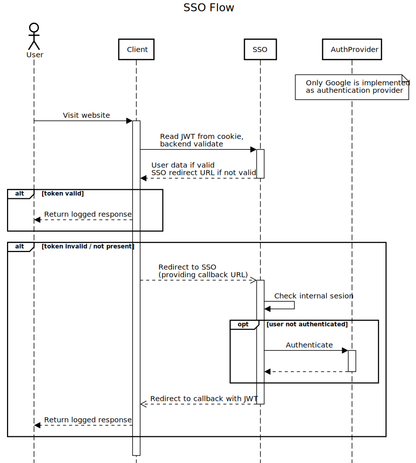

# SSO

## Admin (Laravel)

SSO Admin serves as a tool for management of API keys.

When the backend is ready, don't forget to create `.env` file (use `.env.example` as boilerplate), install dependencies and run DB migrations:

```bash
# 1. Download PHP dependencies
composer install

# 2. Download JS/HTML dependencies
yarn install

# !. use extra switch if your system doesn't support symlinks (Windows; can be enabled)
yarn install --no-bin-links

# 3. Generate assets
yarn run dev // or any other alternative defined within package.json

# 4. Run migrations
php artisan migrate

# 5. Generate app key and JWT secret
php artisan key:generate
php artisan jwt:secret

# 6. Run seeders (optional)
php artisan db:seed

```

#### Dependencies

- PHP ^8.2
- MySQL ^8.0
- Redis ^6.2
- Node.js >=18

##### Redis Sentinel

Application supports Redis to be configured with the Sentinel cluster. In order to enable the integration, see `.env.example` file and `REDIS_SENTINEL_SERVICE` variable.

## SSO flow

### Base flow of actions

Here you can see simplified view of how Mailer works at following diagram.



### Libraries

We've prepared libraries for Laravel and Nette applications that easily integrate with SSO.

Libraries are provided within the main REMP repository. See their documentation to find out
how to use them within the application.

* [Nette library](../Composer/nette-sso)
* [Laravel library](../Composer/laravel-sso)

Note: The default configuration of all REMP tools has these libraries integrated and enabled.

### Google provider

Google SSO is supported by default. You may disable it by removing it from `auth.sso_providers` configuration.

To specify which email is allowed to login, specify white list of emails or domains to `JWT_EMAIL_PATTERN_WHITELIST` variable.
The variable may contain list of emails or domains (email is verified to end with the given pattern) separated by comma.

#### Examples

```dotenv
# Allows any email from 'example.com' or 'testuser@gmail.com' to sign in
JWT_EMAIL_PATTERN_WHITELIST=@example.com,testuser@gmail.com

# Disables email validation (not recommended)
JWT_EMAIL_PATTERN_WHITELIST=*
```

### Custom providers

In case you want to implement your own SSO provider, you need to:

- Enable the provider in `auth.sso_providers` configuration.
  ```
  'sso_providers' => [
      'google' => 'Google',
      // define additional providers in services.php and enable them here
  ],
  ```
- Implement the provider in its own controller.
- Configure redirect route (`auth.PROVIDER`) for the provider with the same key, as you used in the step before. If you used `google` as an SSO provider key, please make sure route `auth.google` is defined. User will be redirected to this route when she selects the provider.

With multiple providers, SSO will behave as follows:

- If there's only one SSO provider registered, SSO will treat it as default provider and redirect user to the provider's login page directly.
- If there are multiple providers, SSO offers a login page with the selection of providers.
- If there's `DEFAULT_SSO_PROVIDER` env variable set, SSO will always use this provider and ignore the rest.

## Auth endpoints

In case you want to make a library for non-supported framework, you'll need to integrate it
against these APIs.

### GET /auth/login

Endpoint accessible for end users. This is the place where they decide how they want to
get logged in.

#### Required query parameters:

* `succesUrl: string`

  Url to which user is redirect after successful login attempt.

  SSO appends *token* query parameter to the response. This token should be sent within
  `Authorization: Bearer %TOKEN%` header for all subsequent requests.

* `errorUrl: string`

  URL to which user is redirected after unsuccessful login attempt.

  SSO appends *error* query parameter with error message explaining why the authentication
  was not successful.

### GET /auth/introspect

API endpoint for services to get user information based on the provided token.

#### Required headers:

* `Authorization: Bearer %TOKEN%`

#### Success response:

* `200 OK`
```
{
  "name": String, // full name of user
  "email": String, // email of user
  "scopes": Array // array of scopes user has access to
}
```

#### Error responses:

HTTP status codes are based on RFC 6750.

* `400 Bad Request`
  * `token_not_provided` error when no token is provided
* `401 Unauthorized`
  * `token_expired` error when token is expired; call `/auth/refresh` to refresh the token
  * `token_invalid` error when token is unparseable
* `404 Not Found`
  * `user_not_found` error when user encoded within token is not found

```
{
  "code": String, // error code
  "detail": String, // error message
  "redirect": String // SSO login URL to redirect user to
}
```

### POST /auth/refresh

API endpoint for services to refresh the token in case it's expired. If `JWT_BLACKLIST_ENABLED`
is set to `true` (default value), it automatically invalidates the old token.

#### Required headers:

* `Authorization: Bearer %TOKEN%`

#### Success response:

* `200 OK`
```
{
  "token": String, // refreshed token
}
```

#### Error responses:

* `400 Bad Request`
  * `token_not_provided` error when no token is provided
  * `token_expired` error when token is expired and unrefreshable; default refresh timeout is 2 weeks
  * `token_invalid` error when token is unparseable
* `404 Not Found`
  * `user_not_found` error when user encoded within token is not found

```
{
  "code": String, // error code
  "detail": String, // error message
  "redirect": String // SSO login URL to redirect user to
}
```

### GET /auth/check-token

API endpoint for services to validate provided API token. Endpoint simply returns whether token
is usable or not and no additional info.

#### Required headers:

* `Authorization: Bearer %TOKEN%`

#### Success response:

* `200 OK`

#### Error responses:

HTTP status codes are based on RFC 6750.

* `404 Not Found`

## Healthcheck

Route `http://sso.remp.press/health` provides health check for database, Redis, storage and logging.

Returns:

- **200 OK** and JSON with list of services _(with status "OK")_.
- **500 Internal Server Error** and JSON with description of problem. E.g.:

    ```
    {
      "status":"PROBLEM",
      "log":{
        "status":"PROBLEM",
        "message":"Could not write to log file",
        "context": // error or thrown exception...
      //...
    }
    ```
